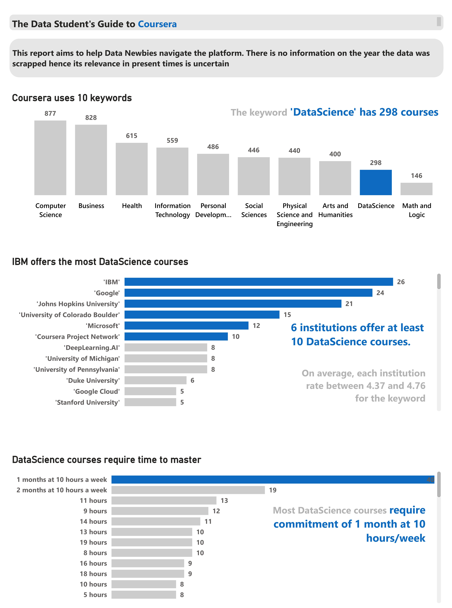

# Coursera-Data-Science-Analysis
Analyzes all Coursera's courses under the Data Science Keyword
--------------
## Overview
Coursera is an EdTech platform consisting of 10 key subjects with several institutions offering courses for these subjects. 
The goal of this analysis was to explore the courses under the subject, ‘data science.’ 
To achieve this, I was required to answer:
1.	The total number of courses offered under data science.
2.	The institutions offering at least 10 data science courses.
3.	The time required to finish most data science courses.

## Dataset
The dataset consisted of 9 columns; course title, institutions, tutors, keywords, skilled gained, schedule, course URL, ratings, and duration.

## Data Cleaning and Manipulation
During the data cleaning, a distinct id was attached to each course. Also, due to the numerous blanks in the skilled gained section, the column was removed. The course URL was also removed. Duplicate values from the course title were also removed. The duration column was formatted so that values on column were represented in minutes, hours, days, weeks, or months.

## Data Modelling
The dataset consisted of only one table. 

## Data Analysis and Result

1.	Data Science subject consist of 298 courses with IBM, Google, and 4 other institutions offering at least 10 courses for the keyword. 
2.	Most data science courses require a commitment of 1 month at 10 hours a week. 
3.	On average, each institution offering data science course rate between 4.37 to 4.76 for the subject.

## Recommendation
As a data student navigating Coursera, start with the top 6 institutions offering at least 10 data science courses. They will offer a better roadmap for your studies than institutions offering 1 or 2 courses for the keyword.
Also, be prepared to commit at least 1 month to these courses. 
